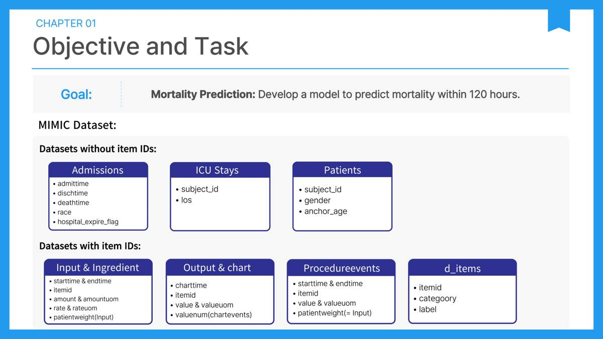
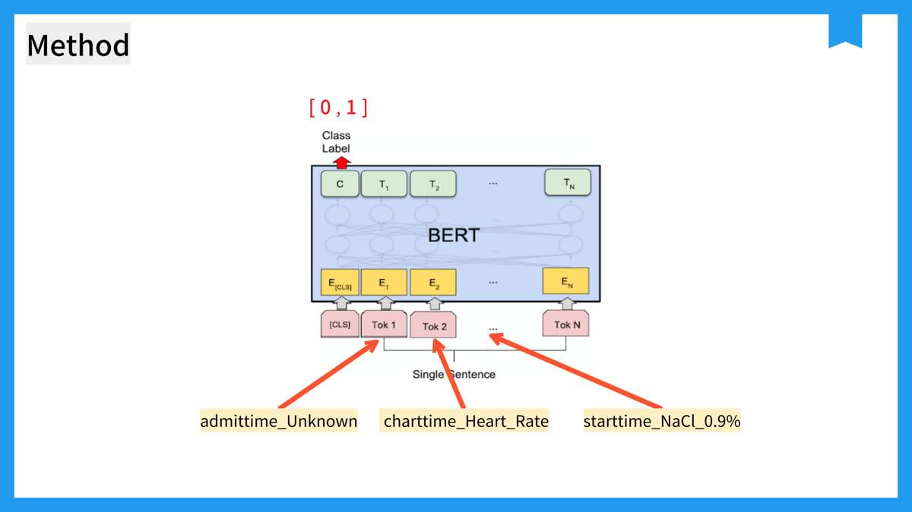
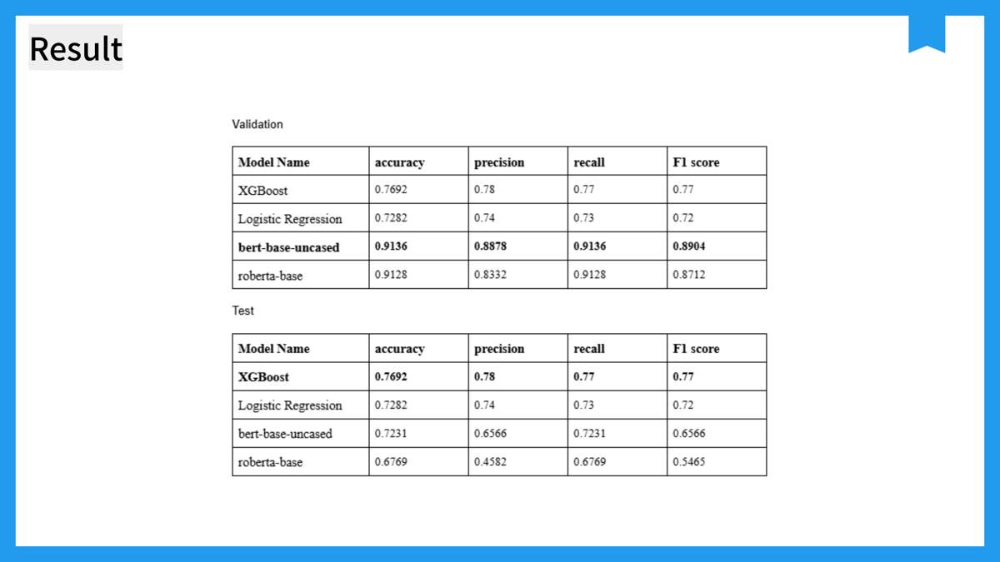
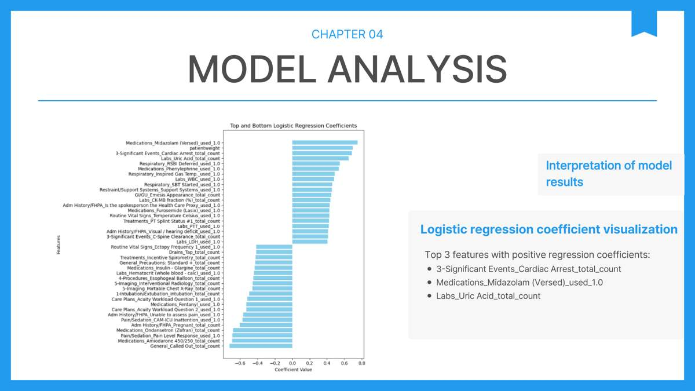
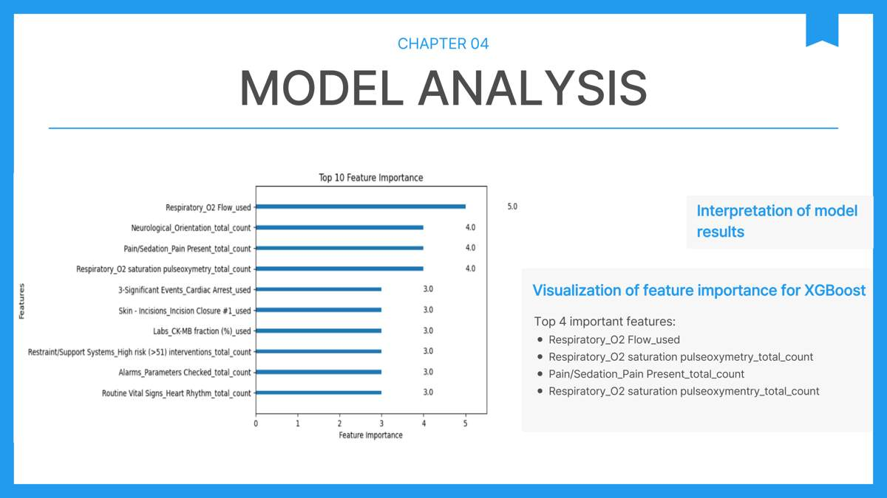

# Patient Mortality Prediction with MIMIC Data

**Clinical data integration, tabular modeling, and event-sequence classification**

A team project exploring patient mortality, culminating in a final comparison of models predicting **death within 120 hours of admission**. The final presentation compares XGBoost and logistic regression with BERT and RoBERTa applied to chronological clinical-event text.

[Portfolio](https://incredible-march-0ef.notion.site/66068564df5a83329dc2012278107120)

## Project Overview

| Item | Description |
| --- | --- |
| Final objective | Predict mortality within 120 hours of admission |
| Data | MIMIC clinical records and item dictionaries |
| Reported partition | 1,615 training patients / 390 test patients |
| Models | XGBoost, logistic regression, BERT, RoBERTa |
| Final report | December 1, 2024 |
| Available code | Final tabular modeling, sequence preprocessing, BERT/RoBERTa training and evaluation; earlier exploratory analysis |
| Final experiment status | Original final notebooks recovered; historical metrics have not been rerun |

## Data Integration




Admission, ICU, demographic, medication, procedure, and chart-event tables were joined using `subject_id` and `hadm_id`. Item dictionaries supplied categories and labels. Clinical events were sorted by their timestamps and consolidated into patient/admission records.

## Approach

### Tabular Features and Models

The final report describes label-use indicators, event counts, average durations, ICU length of stay, and demographics. It reports 5,240 initial columns, removal of highly missing and constant columns, and approximately 3,900 final features. `hospital_expire_flag` and `survival_hours` were excluded as predictors of `Dead_within_120_hours`.

XGBoost and logistic regression were tuned using grid search and five-fold cross-validation. The training partition was split 80:20 for training and validation. Additional tree, SVM, boosting, and KNN comparisons were presented.

### Clinical Event Sequences




Chronologically ordered event types and item labels were serialized into text. BERT and RoBERTa were fine-tuned with learning rate `2e-5`, batch size `16`, `10` epochs, and weight decay `0.01`; checkpoints were selected using validation F1.

The report describes 6,478 training admissions from 1,615 patients and 390 test admissions, using each test patient's last admission. Inputs were limited to 512 tokens. Elapsed time ordered events but was not implemented as a separate time embedding.

## Final Results




| Model | Validation accuracy | Validation F1 | Test accuracy | Test F1 |
| --- | ---: | ---: | ---: | ---: |
| XGBoost | 0.7692 | 0.77 | 0.7692 | 0.77 |
| Logistic regression | 0.7282 | 0.72 | 0.7282 | 0.72 |
| BERT | 0.9136 | 0.8904 | 0.7231 | 0.6566 |
| RoBERTa | 0.9128 | 0.8712 | 0.6769 | 0.5465 |

The final summary reports the strongest test result for XGBoost and substantial validation-to-test decline for the Transformer models. Metric averaging is unspecified. Earlier baseline slides give different tabular accuracies; this table follows the final summary and matching report table. See [Results and source differences](docs/results.md).

### Model Interpretation







## Limitations

- The observation window extends through the 120-hour outcome horizon. A clearly defined earlier cutoff is needed to establish admission-time forecasting.
- Tabular and sequence experiments use different representations and admission sampling.
- Patient-group separation in the sequence train/validation split is not established by the report.
- Quantitative clinical values and elapsed-time embeddings were not fully incorporated into the sequence models; 512-token truncation limits long histories.
- The final summary repeats tabular validation/test values and differs from earlier baseline slides. Original logs are needed to resolve these discrepancies.
- No external validation or new metric reproduction is claimed.

## Final Code

| Notebook | Purpose |
| --- | --- |
| [Tabular modeling](notebooks/final/tabular_modeling.ipynb) | Clinical-table integration, 120-hour target construction, EDA, feature processing, XGBoost/logistic regression and comparison models |
| [Sequence training-data preprocessing](notebooks/final/sequence_preprocessing_train.ipynb) | Event timelines, time-window filtering, item mapping, training text preparation |
| [Sequence test-data preprocessing](notebooks/final/sequence_preprocessing_test.ipynb) | Last-admission selection and test text preparation |
| [Sequence training and evaluation](notebooks/final/sequence_training_evaluation.ipynb) | BERT/RoBERTa fine-tuning and evaluation |

[Setup and execution order](docs/execution.md) · [Data security policy](docs/data-security.md)

## Data Security

**Patient-level data is strictly excluded from this public repository.** Clinical CSVs contain sensitive health records, patient/admission identifiers, timestamps, treatments, and outcomes. Even de-identified records remain subject to source access and data-use restrictions; de-identification does not authorize redistribution.

Raw and processed patient CSVs, patient-level JSON/event text, notebook outputs, dataset archives, and locally generated model artifacts are not published. Access to source data must be obtained independently through the authorized provider and used only in an approved private environment. Do not commit data, submit records in issues, or share screenshots containing patient information.

The repository publishes source code and aggregate presentation figures only. All recovered notebooks have stored outputs, execution counts, attachments, and cell metadata removed. `.gitignore` provides an additional guard against accidental inclusion of clinical data and artifacts.

## Code and Earlier Analysis

The earlier exploratory notebook analyzes **in-hospital mortality**; it does not implement the final 120-hour XGBoost/BERT comparison. The earlier 57.97% accuracy and 0.605 ROC-AUC belong to that exploratory stage.

- [Original exploratory notebook](notebooks/original_analysis.ipynb)
- [Earlier logistic-regression experiment](notebooks/mortality_modeling.ipynb)
- [Earlier analysis documentation](docs/earlier-analysis.md)
- [Final methodology](docs/methodology.md)
- [Final results and limitations](docs/results.md)

```bash
pip install -r requirements.txt
jupyter notebook
```

For the earlier model notebook, place the authorized prepared CSV at `data/testing_h.csv` and run from the `notebooks` directory. The original archive retains Colab paths and historical cell order; stored outputs and metadata are removed. This setup runs the earlier experiment only. Final experiment instructions are in [Setup and execution order](docs/execution.md). Patient-level records are excluded.

## Review

The project compared aggregate clinical features with event-text representations. Held-out performance, patient-level partitioning, and a clearly defined observation window were central lessons alongside model complexity.
