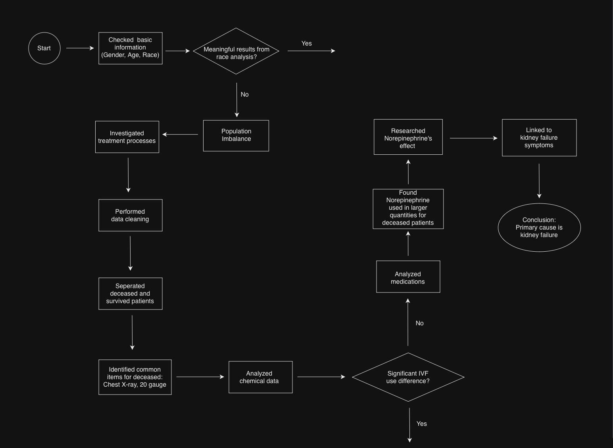
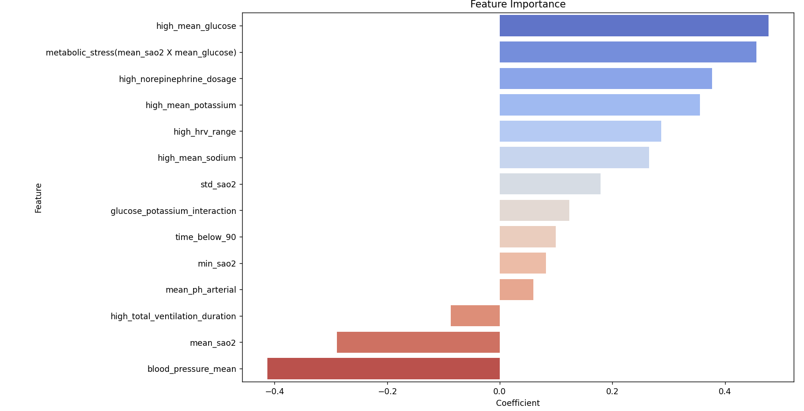
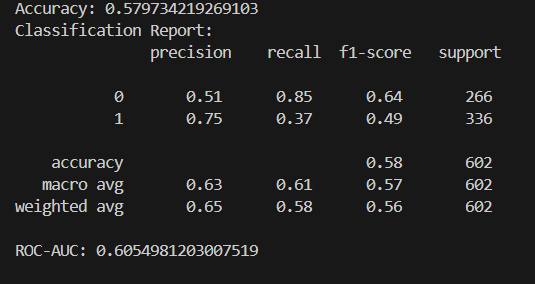

# Patient Mortality Factor Analysis

**Clinical Data Visualization & Modeling**

A team project analyzing clinical records from **2,005 cardiac-arrest patients** to explore factors associated with in-hospital mortality. The workflow combines patient-level data integration, exploratory analysis, threshold-based feature engineering, and interpretable classification.

[Portfolio](https://incredible-march-0ef.notion.site/66068564df5a83329dc2012278107120)

## Project Overview

| Item | Description |
| --- | --- |
| Course | Data Analysis Visualization |
| Submission | November 26, 2024 |
| Project type | Team project |
| Objective | Explore mortality-associated clinical factors |
| Dataset | 2,005 cardiac-arrest patients |
| Target | `hospital_expire_flag` |
| Technologies | Python, Pandas, NumPy, scikit-learn, imbalanced-learn, Matplotlib, Seaborn |

## Problem

Which clinical variables differ between survivors and non-survivors, and how well can they distinguish in-hospital mortality?

The analysis examines demographic, treatment, and physiological information together. Its purpose is to interpret patterns in observational data; the findings do not establish causal effects.

## Data & Processing

| Outcome | Patients | Share |
| --- | ---: | ---: |
| Non-survivors | 1,147 | 57.2% |
| Survivors | 858 | 42.8% |
| Total | 2,005 | 100% |

Clinical tables were joined by patient ID to create a patient-level analysis dataset.

- Integrated demographic, admission, procedure, medication, vital-sign, and laboratory records.
- Handled duplicate records and inconsistent survival outcomes.
- Summarized admission/discharge information and ICU stay at the patient level.
- Organized medication records by type and grouped age into 0–30, 30–60, and 60–90.

**Data availability:** This repository contains recovered analysis code, methodology, and aggregate findings. Original patient records, patient-level samples, and identifiers are excluded because the source data contains sensitive medical information.

## Approach

### Analysis Workflow



*Source: original final report, p. 9. This diagram records the team's exploratory reasoning. Its kidney-failure conclusion is a historical hypothesis; the observational analysis does not establish a primary cause of death.*

### Exploratory Analysis

Initial comparisons covered demographics, procedures, and medications. Uneven race-group sizes limited interpretation of demographic differences. Higher norepinephrine administration was observed among non-survivors, motivating closer examination of treatment and physiological indicators.

The subsequent analysis considered creatinine, electrolytes, urine output, blood pressure, glucose, and oxygen saturation, including indicators related to kidney dysfunction.

### Feature Engineering

Extreme-value flags used the **90th and 10th percentiles** of clinical-variable distributions among non-survivors.

- High-value flags represented variables such as glucose and norepinephrine.
- Low-value flags represented oxygen saturation and blood pressure.
- A **metabolic-stress interaction feature** is calculated as `mean_sao2 * mean_glucose`.

### Modeling

Logistic regression was the primary classifier for the binary mortality target. Coefficient directions supported interpretation of the engineered features. Linear regression was also explored as a continuous-score alternative, but was less suitable for binary classification.

The recovered final experiment uses a stratified 70:30 train/test split (`random_state=42`), SMOTE on the training partition, StandardScaler fitted on the resampled training partition, and `LogisticRegression(max_iter=1000, class_weight='balanced')`.

Detailed workflow: [Methodology](docs/methodology.md).

## Results

| Logistic regression metric | Reported result |
| --- | ---: |
| Accuracy | 57.97% |
| ROC-AUC | 0.605 |
| Precision — non-survivors | 0.75 |
| Recall — non-survivors | 0.37 |

### Model Coefficients



*Source: original final report, p. 11. Bars show fitted coefficients, not causal effects.*

### Historical Evaluation



*Source: original final report, p. 11. Class 0 denotes survivors and class 1 non-survivors. These are original recorded results, not a new run.*

High mean glucose, metabolic stress, and high norepinephrine dosage showed positive associations with mortality in the fitted model. More stable blood-pressure and oxygen-related measurements showed negative associations. Renal-function indicators also emerged as relevant exploratory signals.

These are **associations within the analyzed dataset**. For example, greater norepinephrine exposure may reflect illness severity rather than a causal effect of the medication.

The modest ROC-AUC and low non-survivor recall limit patient-level prediction. The model supports exploratory interpretation and does not demonstrate clinical readiness.

Detailed findings: [Results & Limitations](docs/results.md).

## Limitations & Future Work

- Missing or incomplete records, an imbalanced outcome distribution, and limited clinical context constrain interpretation.
- The recovered code calculates percentile thresholds from all non-survivors before the train/test split. This introduces outcome-informed information from the test partition; future evaluation should estimate thresholds using training patients only.
- No independent external validation was performed.
- Future work could improve missing-data handling, add diagnosis and disease-severity information, incorporate time-series trends, and compare nonlinear models.

## Review

This project connected clinical-table integration with exploratory analysis, feature engineering, and model interpretation. A key lesson was to evaluate predictive limitations alongside statistical associations, and to distinguish those associations from causal or clinical conclusions.

## Documentation

- [Methodology](docs/methodology.md)
- [Results & Limitations](docs/results.md)

## Code & Setup

- [Original analysis notebook](notebooks/original_analysis.ipynb): recovered preprocessing, exploratory plots, and model experiments. Original Colab paths and historical cell order are preserved; stored outputs and cell metadata are removed.
- [Final logistic-regression notebook](notebooks/mortality_modeling.ipynb): the recovered final experiment isolated for use with the prepared model-input table.

```bash
pip install -r requirements.txt
jupyter notebook
```

Place the authorized prepared model-input CSV at `data/testing_h.csv`, then open `notebooks/mortality_modeling.ipynb` and run its cells with the notebook directory as the working directory. The owner confirmed the supplied model-input file corresponds to this analysis. The CSV requires the clinical columns referenced in the notebook and `hospital_expire_flag`; patient records are not distributed.

The original notebook references raw clinical tables and `preprocessing_data(fixed).zip` under `/content/`. It is a historical analysis archive, not a single clean end-to-end pipeline. Adapt those paths and provide the intermediate files before running its exploratory sections.

The reported metrics above are from the original report. The recovered code has not been rerun to reproduce them.
